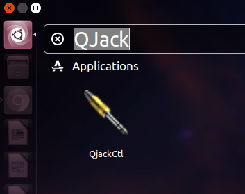
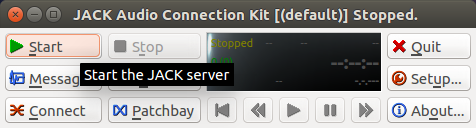
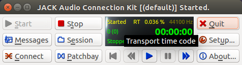
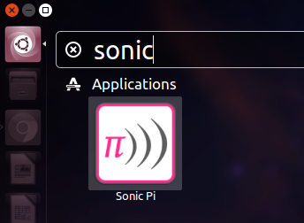
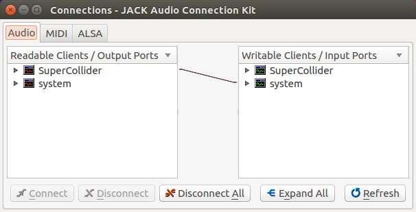

# Cómo iniciar Sonic-pi para el taller y una intro a audio en Ubuntu

## Cómo tener Sonic-pi andando para los talleres

Una vez loggeado el usuario de ubuntu en las pcs:

1. Iniciar QJackCtl.

2. Iniciar el server de jack.

3. El servidor debería decir _started_.

   _Como efecto secundario el resto de las aplicaciones no podrán emitir
sonido, ver abajo._

4. Arrancar Sonic-pi.

## ¿Qué acabo de hacer? (O breve introducción al sonido en linux)

El sonido en linux se organiza en capas de drivers y abstracciones.

Como capa inferior está el hardware, o sea, la placa de sonido que recibe
bits y escupe electricidad en el cablecito que va al parlante.

En linux, inmediatamente por encima están las capas drivers. Hoy en día se usa
ALSA (Advanced Linux Sound Architecture). ALSA vino a reemplazar OSS (Open
Sound System). ALSA se encarga de dar una interfaz de software común para todas
las placas de audio.

ALSA no soporta reproducir sonido de más de una aplicación a la vez.
Ahí entra PulseAudio, una capa superior que se encarga de administrar eso,
entre otras cosas ().

En una configuración común, las aplicaciones se comunican con PulseAudio, que
habla con ALSA que le escribe a la placa de sonido (en realidad, la
configuración muchas veces es ALSA -> PulseAudio -> ALSA -> HW, pero no
importa).

#### ¿Que hace JACK en todo esto?

Jack es otro driver de sonido que cumple una función muy similar a la de
PulseAudio. Jack está pensado para aplicaciones musicales, donde uno tiene una
serie de aplicaciones o dispositivos que reciben y emiten audio y uno quiere
conectar las entradas y salidas entre si. Jack habla directamente con ALSA y,
salvo configuración extra, bloquea el funcionamiento de PulseAudio.

    Esto tiene como efecto que al iniciar Jack como en el paso 2, toda otra
    aplicación en la PC no pueda emitir sonido.

#### Jack y Sonic-pi

Sonic-pi es una interfaz para un sistema que lee código ruby y lo usa para
comunicarse con Supercollider, que provee un servicio que sintetiza audio en
tiempo real. Supercollider se comunica con la placa de sonido a traves de Jack,
motivo por el cual necesitamos el sevidor de Jack también corriendo.

Esto se puede ver en la ventana de conexiones de QJackCtl.

